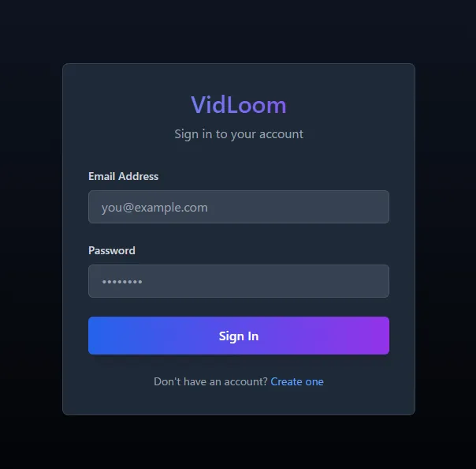
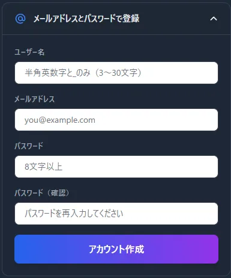
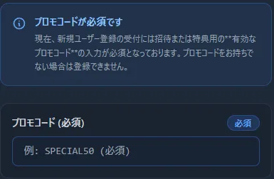
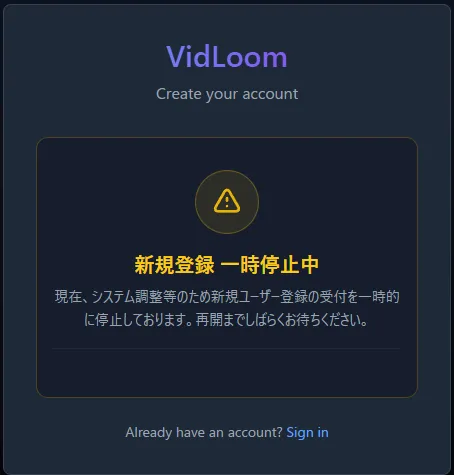

# アカウント作成
VidLoomはアカウントを作らなければ何も始まらない!

## 作成方法
1. ログインページに飛ぶ
    https://vid-loom.com/login

    

2. 下部にある *Create one*を押して登録画面に飛ぶ
    アカウント登録は2種類のパターンがあります
3. 色々設定する
- メールパスワードで登録の場合
ユーザー名、メールアドレス、パスワードを入力して"アカウント作成"を押せば良い

4. プロモコードについて
アカウントの作成の段階で、プロモコードを要求される場合があります  

その場合はプロモコードを持っていないとアカウント作成できません
また、プロモコード必須じゃないときでも入力可能、その場合はコードに設定されてるプランに変更される場合があります
5. 登録できないタイミング
管理者の方でVidLoomのアカウント登録を制限しているときがあります  
いろいろな理由で止めてると思うので、再登録が可能になるのを待ちましょう  

