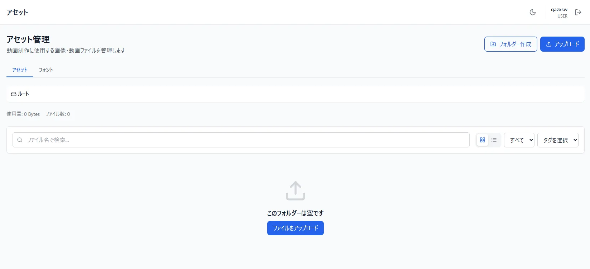
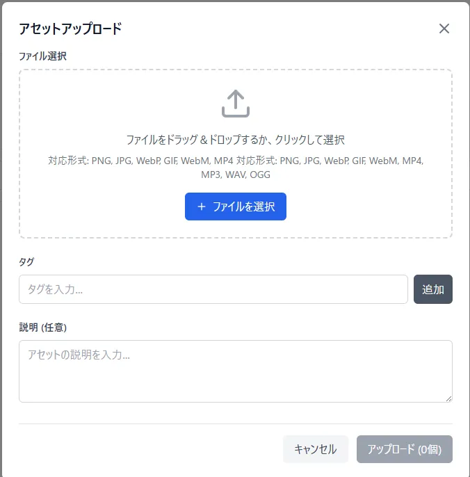
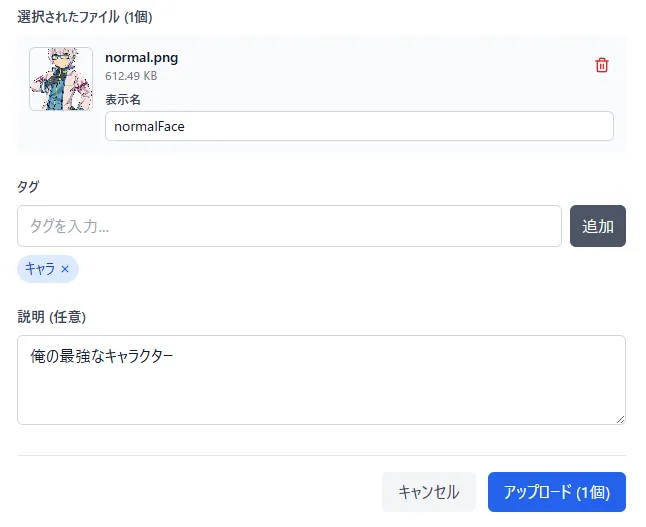
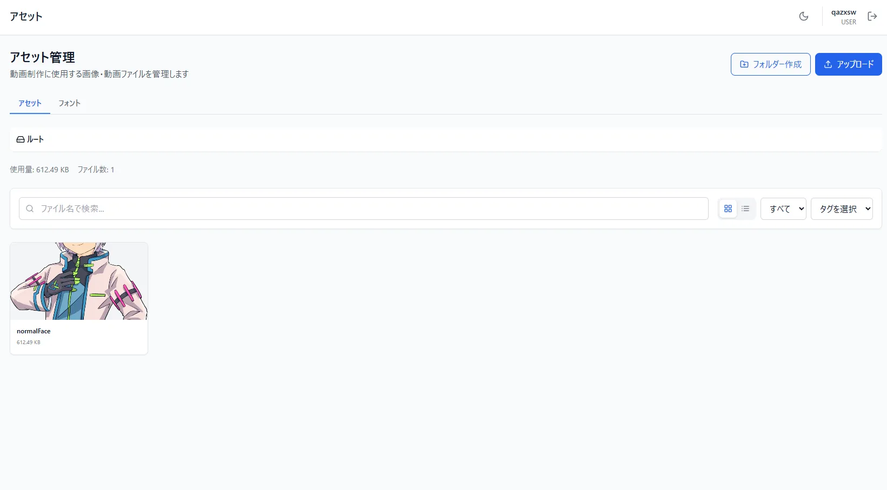
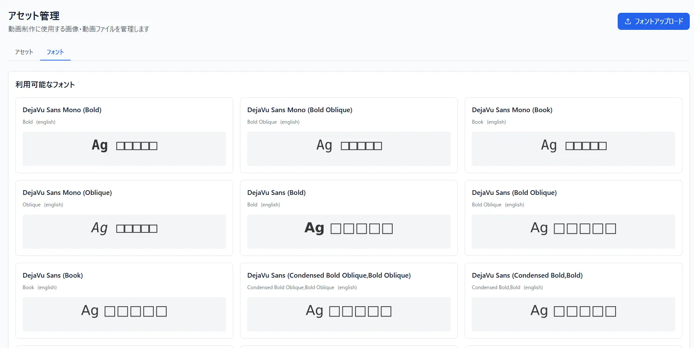
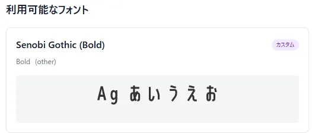

# アセットのアップロード
VidLoomを使う上で絶対に必要な素材のアップロードとかの解説

## アップロード可能素材について
VidLoomでは動画制作に必要な各種素材（画像、音声、フォント）をアップロードして管理できます。

### 1. 画像素材
- **対応フォーマット**:
    - **PNG** (`.png`, `.apng`) - 透過画像の利用に最適
    - **JPEG / JPG** (`.jpeg`, `.jpg`)
    - **GIF** (`.gif`) - **アニメーションGIF / 静止画GIF対応**
    - **WebP** (`.webp`) - 軽量・高画質、透過対応
    - **SVG** (`.svg`) - ベクター画像
    - **BMP / ICO / AVIF** (`.bmp`, `.ico`, `.avif`)
- **💡 GIF画像（アニメーションGIF）の活用について**:
  - キャラクターの立ち絵画像、感情差分、感情アイコン、台本内の画像要素など、あらゆる画像配置箇所でGIFアニメーションが利用可能です。
  - 動画生成（レンダリング）時にもコマ落ちすることなくフレーム単位で正確にアニメーション描画・ループ再生されます。

### 2. 音声素材（効果音・BGM）
- **対応フォーマット**:
    - **MP3** (`.mp3`)
    - **WAV** (`.wav`) - 非圧縮・高音質な効果音に最適
    - **OGG** (`.ogg`)
    - **M4A / AAC** (`.m4a`, `.aac`)
    - **MP4音声** (`.mp4`)

### 3. フォント素材
- **対応フォーマット**:
    - **TTF** (`.ttf`, TrueType)
    - **OTF** (`.otf`, OpenType)
    - **WOFF / WOFF2** (`.woff`, `.woff2`, Webフォント形式)
- アップロードしたフォントは字幕やテロップに即時反映して利用できます。

※ 動画ファイル（背景動画など）の直接配置には**現状対応していません**。
  ## アップロード方法
  - 画像、音声の場合
  登録画面が"アセット"となってることを確認して、画面中央か右上にある"ファイルをアップロード"ボタンを押す    

ファイルを選択を押して、アップロードしたいものを選択する(複数選択可能)  
ファイル個別に対して、自分で名前を決めたり、複数ファイルにタグ付け、説明の追加もできる  

アップロードできたら表示されてるはず  

  - フォントの場合  
※注意※ 有料フォントを使うのはいいけど、ちゃんとライセンスを買うこと。あと基本商業利用可能なものを使うこと。ここらへんのトラブルには管理者は一切関与しません  
登録画面が"アセット"となってることを確認して、画面中央か右上にある"ファイルをアップロード"ボタンを押す    

フォントがアップロードされると速やかに利用可能フォントに加えられます  

ちなみに「利用可能なフォント」一覧で□になってるフォントがあれば*日本語非対応フォント*になってます  