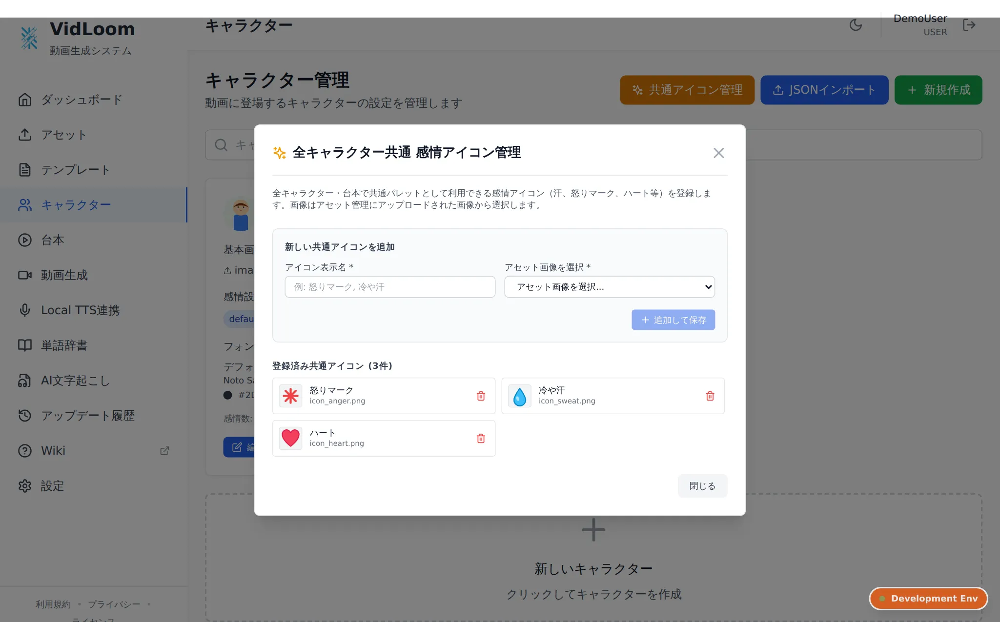
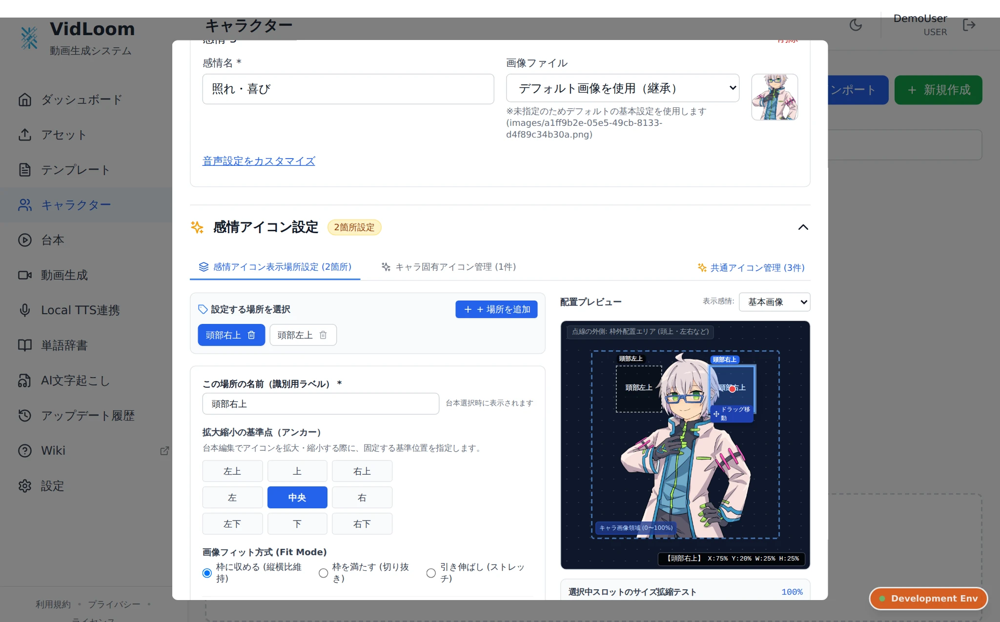
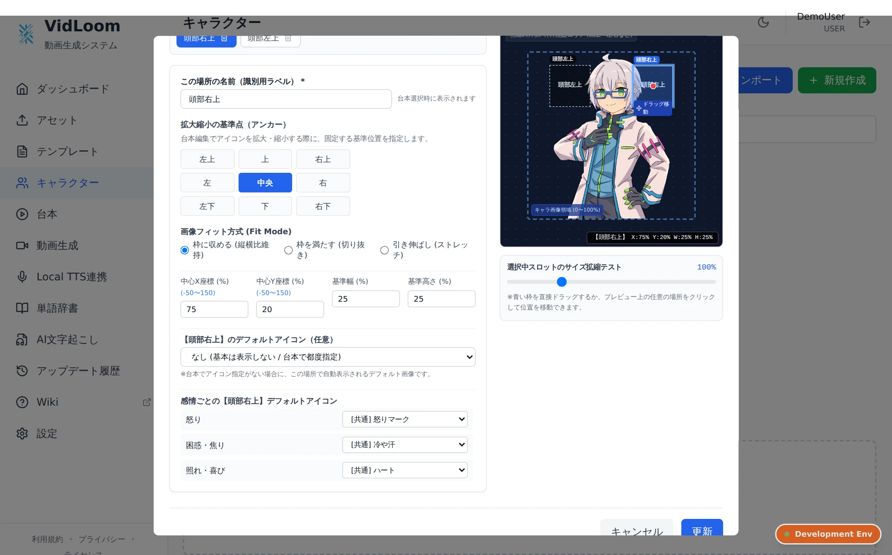
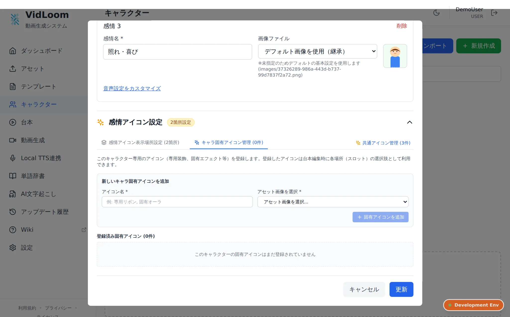

# キャラクターの作成
アセットをアップロードし終わったらキャラクターを作ろう!

## キャラクターとは
VidLoomにおけるキャラクターは画像、字幕、音声の設定がすべて詰まったもののことをいいます  
字幕はこのキャラクターの設定を呼び出して、適切な字幕を描画しようとします  
また、テンプレート内でも"キャラクター"と呼ばれる要素があり、設定した画像を自動で読み込んでくれます  

## 作り方
"キャラクター"というページに飛びます  

ページの中央、または右上の新規作成ボタンを押します  
以下のような画面が出ればよいです  

キャラクターの設定を組むには最低1枚画像がなければなりません  
ないのであればアセットをアップロードしましょう  
最低限設定しなきゃいけないものは、キャラクターのID、名前、デフォルトで表示する画像、フォントの種類と色です  
- 基本情報

キャラクターを扱う上で必要な情報が詰まってます  
キャラクターID:システム上で扱う名前  
キャラクター名:ユーザーが認識しやすい名前  
基本画像:初期状態の表情  
  
- フォント設定

キャラクターが喋るために必要な字幕の情報が詰まってます  
設定名:設定の名前、感情名とかでもいい  
フォント: 使うフォント、アセットでアップロードしたフォントもここで使える  
メインカラー: フォントの色  
縁取り設定: 字幕に対してアウトラインをつけるかどうか、第2縁取りは縁取りの更に外側に設定できる  
プレビュー: 設定した内容で字幕のプレビューを出してくれる  
  
## 任意設定
任意の設定として、合成音声の設定と感情差分の設定ができます

- 音声設定
デフォルトの表情に対して、合成音声の設定を作れます

合成音声ソフト側の設定を済ませて、立ち上げておくと、連携をして合成音声の設定ができるようになります  
TTSエンジン: 使うエンジンの設定、事前に立ち上げておくといい  
ステータス: エンジンとサービスの連携状態が見れる。連携し直しもできる  
キャラクター/スタイル: エンジンから取得したキャラクターモデルとスタイルを選択できる  
各種パラメータ: 枠内右上の"詳細パラメータ"を押すと出てくる。好みの声質にしよう  
試聴: 好きな言葉を入力して試聴できる  

- 感情設定
デフォルトの感情にプラスして、複数の感情差分を設定できます  

設定可能項目は必須項目+音声設定で、一部はデフォルトの設定を引き継ぐことができます  
感情で画像やフォント、音声などの演出を変更したいときにとても便利です  

## 感情アイコン機能（PRO / PREMIUMプラン）
キャラクターの立ち絵画像の上に、漫画やアニメのような感情マーク（怒りマーク💢、冷や汗💧、ハート❤️など）や固有のエフェクトを重ねて表示できる機能です。  
立ち絵のバリエーション画像を何枚も用意しなくても、同じ表情に感情アイコンを組み合わせることで多彩な感情表現やシチュエーションを豊かに演出できます。

### 1. 全キャラクター共通 感情アイコン管理
キャラクター管理画面（[vid-loom.com/characters](https://vid-loom.com/characters)）の右上にある**「共通アイコン管理」**ボタンから設定します。

- **共通アイコンの登録**:
  - アセット管理にアップロードした画像（透過PNG等）を選択し、表示名（例: 怒りマーク、冷や汗、ハートなど）をつけて追加します。
  - ここに登録したアイコンは、すべてのキャラクターおよび台本編集画面で共通のパレットとして呼び出して利用できます。
- **登録済みアイコンの削除**:
  - 不要になった共通アイコンは右側のゴミ箱ボタンからいつでも登録解除できます。

### 2. キャラクターの感情アイコン表示場所（スロット）設定
各キャラクターの編集画面にある**「感情アイコン設定」**アコーディオンを開くと、アイコンを表示する場所（スロット）を設定できます。

- **複数スロットの追加**:
  - 「＋ 場所を追加」ボタンから、「頭部右上」「頭部左上」「胸元」「頭上」など、キャラクターごとにアイコンを表示したい場所を何箇所でも自由に追加できます。
- **直感的な配置プレビュー**:
  - 右側の配置プレビュー画面上に青い枠線が表示され、直接ドラッグ＆ドロップすることでアイコンの表示位置を直感的に動かすことができます。
  - キャラクターの枠外（頭上や真横など）にも自由に配置可能です。
- **表示感情のプレビュー切り替え**:
  - プレビュー右上の「表示感情」ドロップダウンを切り替えることで、各表情での見え方をリアルタイムに確認できます。

### 3. スロットの詳細パラメータ設定と感情差分への割り当て
スロットごとに座標やサイズ、拡大縮小の軸となる基準点を細かく調整できます。

- **詳細パラメータ**:
  - **識別用ラベル**: 台本作成時に表示される場所の名前です（例: 頭部右上）。
  - **拡大縮小の基準点（アンカー）**: 9方向グリッド（中央、左上、上、右下など）から選択します。台本側でアイコンを拡大縮小した際、どの点を軸にサイズが変わるかを固定できます（例: 頭上から生えているように見せるなら下基準、右肩から浮くなら左基準など）。
  - **画像フィット方式 (Fit Mode)**: 「枠に収める（縦横比維持）」「枠を満たす（切り抜き）」「引き伸ばし（ストレッチ）」から選択します。
  - **中心座標 (X%, Y%)**: キャラクター画像の幅・高さを基準にした中心位置（%）です。直接数値入力も可能です。
  - **基準サイズ (幅%, 高さ%)**: アイコン表示領域の大きさ（%）です。
  - **デフォルトアイコン（任意）**: その場所で常に表示させたいアイコンがあれば指定します。
- **感情ごとのデフォルトアイコン割り当て**:
  - キャラクターの感情差分（怒り、困惑・焦り、照れ・喜びなど）ごとに、各スロットで自動表示させたい感情アイコンをあらかじめ割り当てておくことができます。
  - これを設定しておくと、台本側で感情を選択した際に、連動して自動的に適切な感情アイコンがセットされます。

### 4. キャラクター固有アイコン管理
キャラクター編集画面の「キャラ固有アイコン管理」タブでは、そのキャラクター専用の装飾や特殊エフェクトを登録できます。

- 全キャラクター共通のアイコンとは異なり、専用のオーラやアクセサリなど「特定のキャラクターだけが使うアイコン」を登録・整理するのに最適です。
- ここに登録したアイコンは、このキャラクターを台本で使用した際に選択肢として表示されます。
