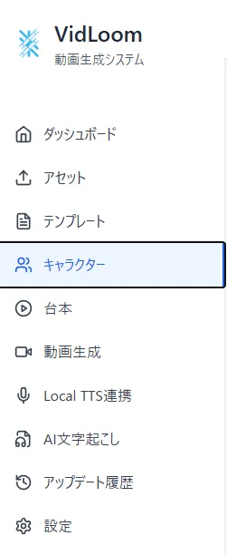
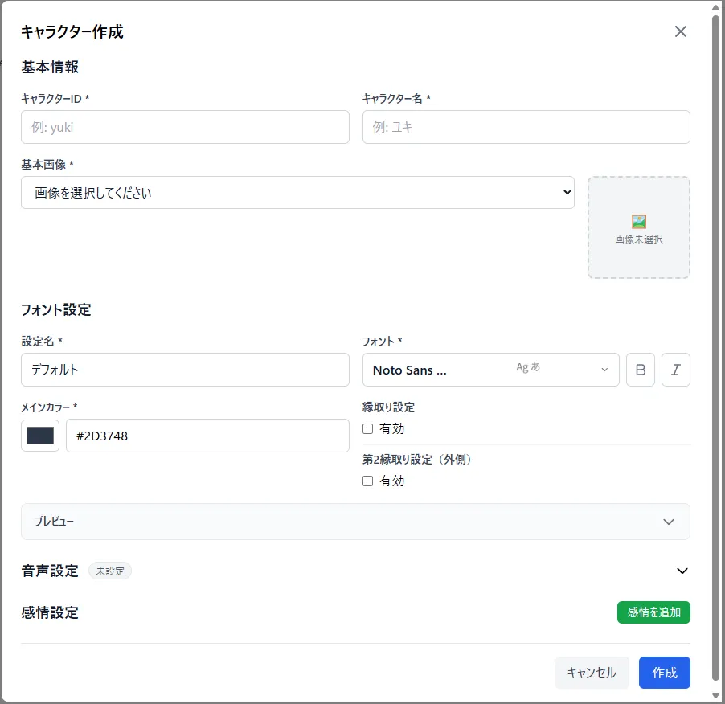
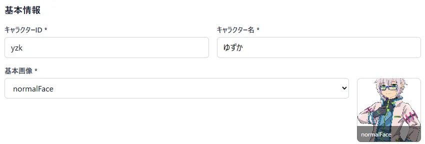
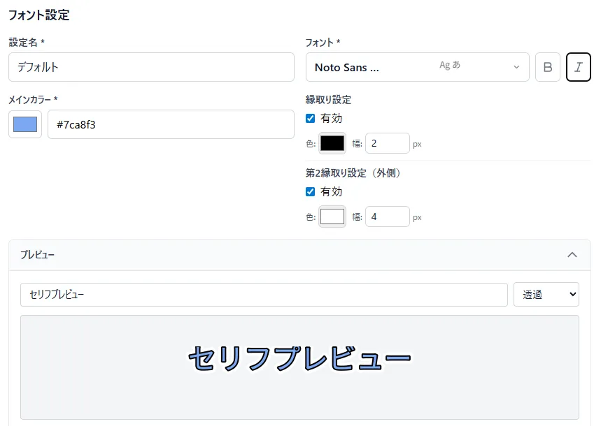
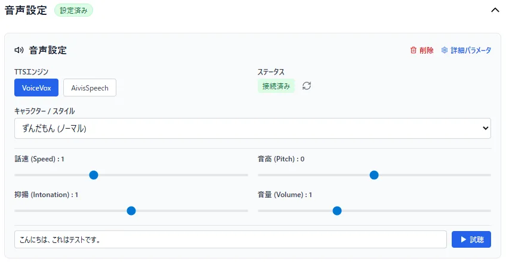
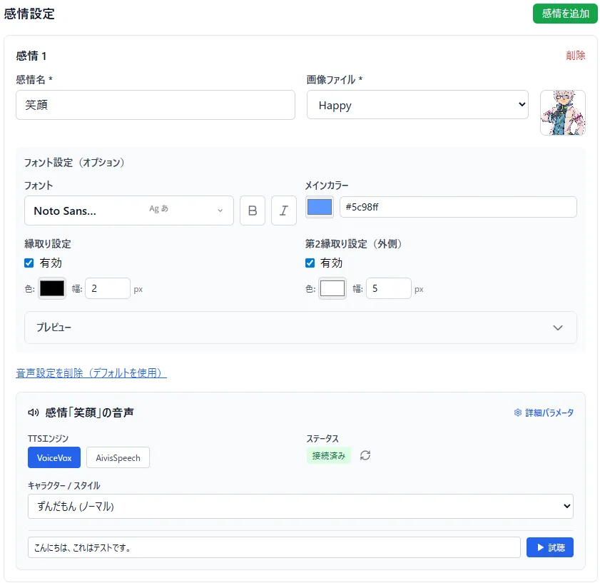

# キャラクターの作成
アセットをアップロードし終わったらキャラクターを作ろう!

## キャラクターとは
VidLoomにおけるキャラクターは画像、字幕、音声の設定がすべて詰まったもののことをいいます  
字幕はこのキャラクターの設定を呼び出して、適切な字幕を描画しようとします  
また、テンプレート内でも"キャラクター"と呼ばれる要素があり、設定した画像を自動で読み込んでくれます  

## 作り方
"キャラクター"というページに飛びます  

ページの中央、または右上の新規作成ボタンを押します  
以下のような画面が出ればよいです  

キャラクターの設定を組むには最低1枚画像がなければなりません  
ないのであればアセットをアップロードしましょう  
最低限設定しなきゃいけないものは、キャラクターのID、名前、デフォルトで表示する画像、フォントの種類と色です  
- 基本情報

キャラクターを扱う上で必要な情報が詰まってます  
キャラクターID:システム上で扱う名前  
キャラクター名:ユーザーが認識しやすい名前  
基本画像:初期状態の表情  
  
- フォント設定

キャラクターが喋るために必要な字幕の情報が詰まってます  
設定名:設定の名前、感情名とかでもいい  
フォント: 使うフォント、アセットでアップロードしたフォントもここで使える  
メインカラー: フォントの色  
縁取り設定: 字幕に対してアウトラインをつけるかどうか、第2縁取りは縁取りの更に外側に設定できる  
プレビュー: 設定した内容で字幕のプレビューを出してくれる  
  
## 任意設定
任意の設定として、合成音声の設定と感情差分の設定ができます

- 音声設定
デフォルトの表情に対して、合成音声の設定を作れます

合成音声ソフト側の設定を済ませて、立ち上げておくと、連携をして合成音声の設定ができるようになります  
TTSエンジン: 使うエンジンの設定、事前に立ち上げておくといい  
ステータス: エンジンとサービスの連携状態が見れる。連携し直しもできる  
キャラクター/スタイル: エンジンから取得したキャラクターモデルとスタイルを選択できる  
各種パラメータ: 枠内右上の"詳細パラメータ"を押すと出てくる。好みの声質にしよう  
試聴: 好きな言葉を入力して試聴できる  

- 感情設定
デフォルトの感情にプラスして、複数の感情差分を設定できます  

設定可能項目は必須項目+音声設定で、一部はデフォルトの設定を引き継ぐことができます  
感情で画像やフォント、音声などの演出を変更したいときにとても便利です  