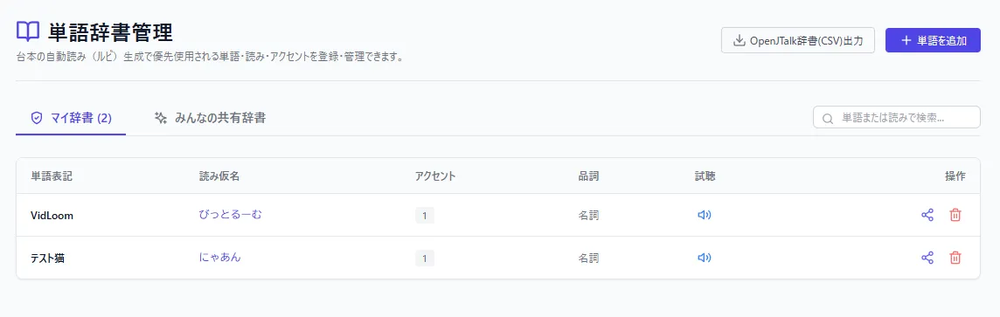
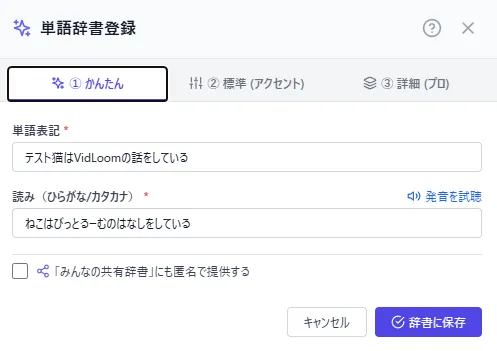
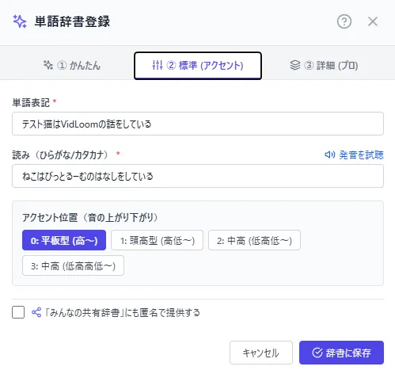
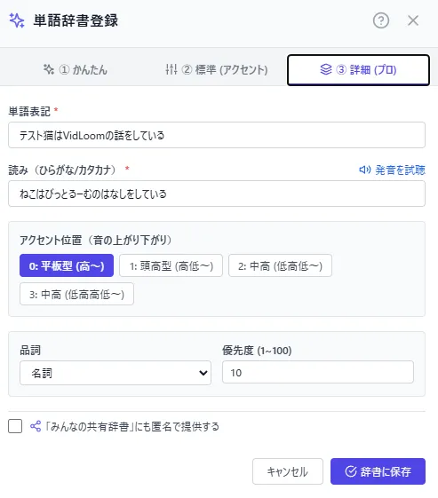
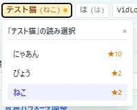

# 辞書登録
TTSがいい感じに読んでくれない?じゃあ辞書を作ろう!

## 辞書とは
辞書とは、TTSが単語を正しく読んでくれないときに、読み方を指定するための機能です  
VidLoomのローカルTTS連携では、使うTTSがデフォルトで使用する辞書に頼って生成するか、VidLoom側が読み方を与えて、それを出力する2つの方式を取っています  
後者のVidLoom側で読み方を与える方式で活躍するのがこの辞書機能です  

## 登録方法
2種類方法があります  

### 1. **単語辞書** ページで登録する
単語辞書ページに入ると、自分専用の辞書と、サービスを使ってる全員で共有している辞書の2つが存在します  
  
ページ右上にある"単語を追加"ボタンを押して登録したい単語の情報を入力、登録します  

### 2. **台本管理** ページで字幕を作りながら登録する
Premiumプラン以上のユーザーには台本管理の字幕要素に読みを自動生成する機能と辞書登録するボタンが用意されています  
そこから登録することができます  
  

## 詳しい登録の仕方
単語の登録は"かんたん登録"、"標準登録"、"詳細登録"の3つの方法があります  

### かんたん登録
基本的には登録したい単語とその読みだけを入力するモードです   
アクセントは平音になるように設定されます  
  

### 標準登録
かんたん登録に、アクセントの概念が追加されます  
アクセント位置がちょっと違うものにはこちらを選ぶとより正確に発音させることができます  
  

### 詳細登録
標準登録の項目にプラスして、品詞や優先度の設定が可能です  
より単語の振る舞いを制御したいときに使います  
  

## 共有辞書について
ユーザーが個別に登録した単語の読みをサービス全体で使えるようにする機能です  
最近できた言葉やネット用語、英語の発音などを共有して、みんなで良い発音を体験できるようにしましょう！

同じ単語に対して登録されている読みを複数ある場合は、登録数が多いものが上位に採用されます  
また、その読みが採用されたことがあるユーザーが投票することで、より上位の読みが採用されるようになります  
さらに、台本管理で読み自動生成を行った際に単語ごとに読みが複数あれば、自身で選択することも可能です  
  

## 辞書のエクスポート
登録した個人/共有辞書はダウンロードすることができます  
ダウンロードするとOpenJTalk辞書のフォーマットになったcsvファイルが出てくるので対応しているソフトウェアにインポートすればローカルTTSでも同じ様に発音させることができます  
ローカルTTSへの登録方法は各ソフトウェアの仕様を確認してください  