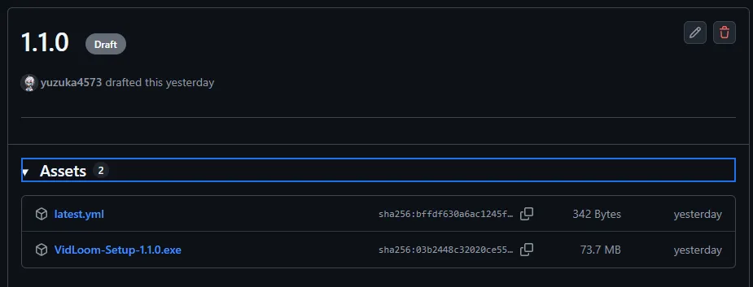

# ローカルレンダリングについて  
Premium, Proプランからはサーバーを使わずにユーザーのPCで動画生成ができるローカルレンダリング機能が追加されます  

## 2種類のローカルレンダリング  
ローカルレンダリングにはWeb上で動画生成できるタイプとアプリケーションを導入して動画生成できる2つがあります  
  
- Web版ローカルレンダリング    
  - 動画を等倍で生成可能  
  - 一部の動画形式は出力不可(透過系の形式)  
  - 動画のダウンロードをしそびれるともう一回生成しなきゃいけない  
  - ポイント消費は追加で100pts  
  
- アプリ版ローカルレンダリング  
  - 動画を高速で生成可能(PCスペックによる)  
  - すべての動画形式を出力可能  
  - 出力した動画はPC内のVideosフォルダに作られるVidLoomフォルダに保存される  
  - ポイント消費は追加で200pts  
　　
## アプリ版の導入方法
1. 自分のアカウントのプランがProプランになっていることを確認する  
2. [ここのページ]()から、最新バージョンのVidLoom-Setup-X.X.X.exeをダウンロードする  
  
3. ダウンロードしたexeファイルをダブルクリックしてインストールを開始する
4. インストール後にシステムが必要とするFFmpegを導入する  
    - Windowsの標準機能で導入する場合  
        1. コマンドプロンプト または ターミナルを立ち上げる  
        2. `winget install ffmpeg`と入力して実行  
        3. 念のためPCを再起動しておく  
          
    - ファイルを自前で用意する  
        1. ビルド済みのFFmpegをダウンロード、展開しておく  
        2. アプリを立ち上げて、FFmpeg設定からffmpeg.exeを指定する  

## 出力方法
- Web版の場合
    1. 動画生成のページに移動して、普段通りに台本と出力形式の指定をする
    2. 生成形式を**ブラウザ内で生成**を選択
    3. 動画生成 / プレビュー生成を行う  
    4. 生成終了後にウィンドウが出てくるのでダウンロードを選択して保存する(履歴には残らないので注意)
- アプリ版の場合
    1. デスクトップに作られたショートカットのVidLoomをダブルクリックして起動する  
    2. 普段通りにログインすると、動画生成の画面に移動する  
    3. 生成したい台本と出力形式を指定して、 **アプリケーションで生成**を選択する  
    4. そのまま動画生成 / プレビュー生成を行う  
    5. 生成が終わると自動的に保存場所の `C:/Users/[ユーザー名/]Videos/VidLoom` に出力される  

## 注意点
- ローカルレンダリングはアセットや台本の読み込みがあるため、オフラインでの稼働はしません  
- Web版ローカルレンダリングは、等倍での動画出力を行うため、出力する台本によっては長い時間高負荷になる場合があります
    - 途中でタブを閉じたり、ブラウザ自体を閉じるとキャンセルされます
    - いかなるシチュエーションでのキャンセルであってもポイントの返還はされませんのでご注意ください
- アプリ版ローカルレンダリングにはFFmpegの導入が必須です
    - 導入方法は アプリ版導入方法 をご確認ください
- アプリ版ローカルレンダリングには多くのマシンパワーを使います
    - もし出力がうまくいかない場合はアプリの再導入やサーバーレンダリングを試してください  

    
