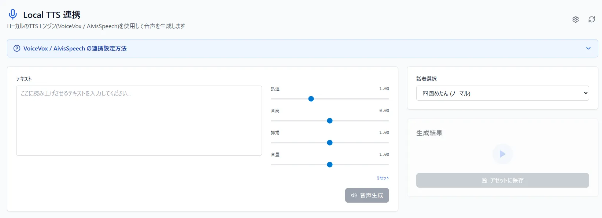
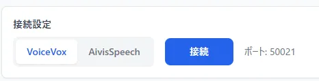
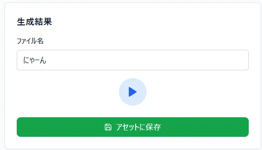
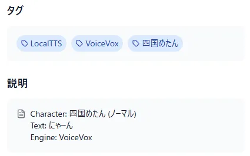

# ローカルTTS連携  
ローカルTTS連携は、VoiceVoxやAivisSpeechをVidLoomで使う機能です  

## 事前設定  
Webブラウザとソフトがやり取りするために以下の手順を踏んで、設定する必要があります  
1. VoiceVoxかAivisSpeechをインストールする  
2. 初回起動を済ませる  
3. 起動した状態でWebブラウザで http://localhost:50021/setting (VoiceVox) / http://localhost:10101/setting (AivisSpeech) にアクセス  
4. Allow Origin に https://vid-loom.com を追加する  
5. ページの右下に保存したと出たらVoiceVox/AivisSpeechを再起動  
6. VidLoom側のページ右上の更新ボタンかページを更新  
  
## 使用方法  
事前設定が済んでいて、ページにアクセスする前にソフトウェアが立ち上がってること前提です  
立ち上げてないでアクセスしてる場合は、立ち上げ後、ページ右上の更新ボタンを押すと連携されます  
また、AivisSpeechを使う場合は同じくページ右上の設定ボタンより、ソフトウェアを選択してください  

  
  
使い方は、ソフトウェアでの音声合成に似ています  
話者選択で喋らせたいキャラクター/スタイルを指定、*テキスト*で喋らせたい文章を入力、その横のパラメータで声の調整、最後に音声生成で実際に喋らせます  
喋らせた内容は*生成結果*で視聴が可能で、そこから直接アセットにアップロードもできます  
アップロード時は自分でファイル名を指定することができます  

  

なお、アップロードされた音声には自動で説明文とタグが付与されるので、何を生成したかの確認や、検索に活用してください  

