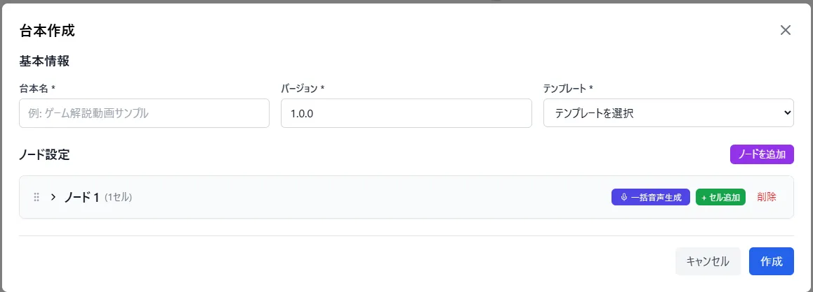
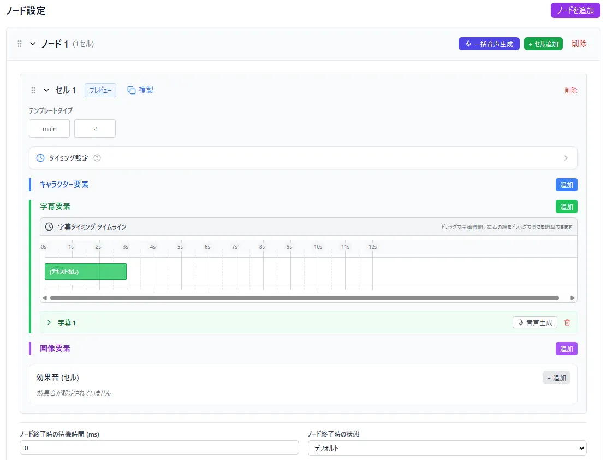
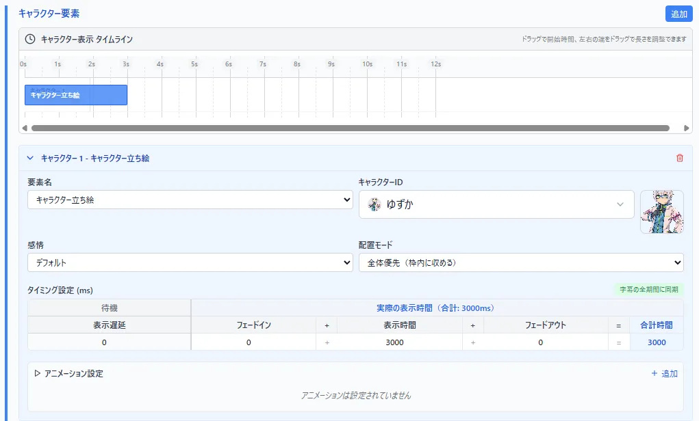
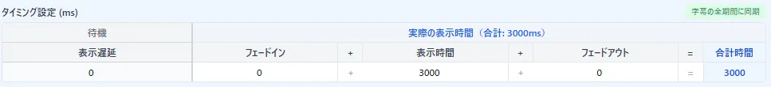
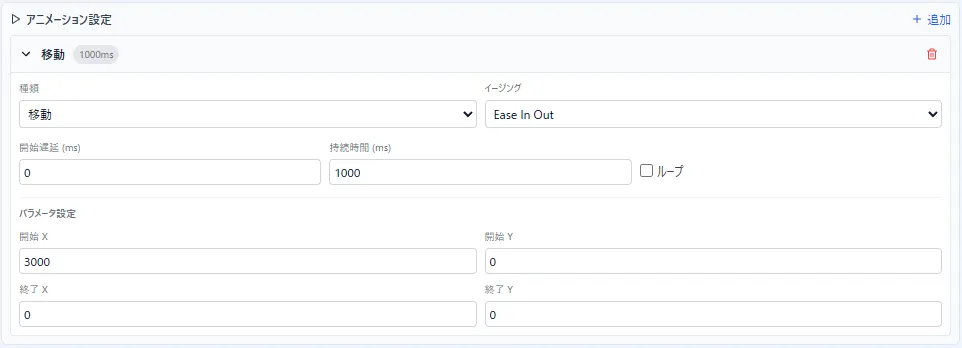
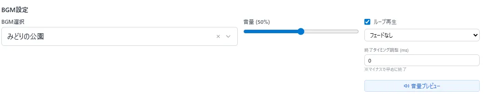
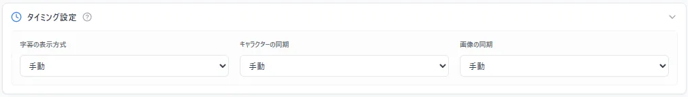
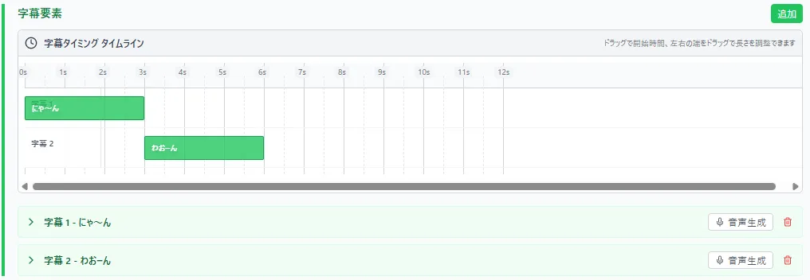
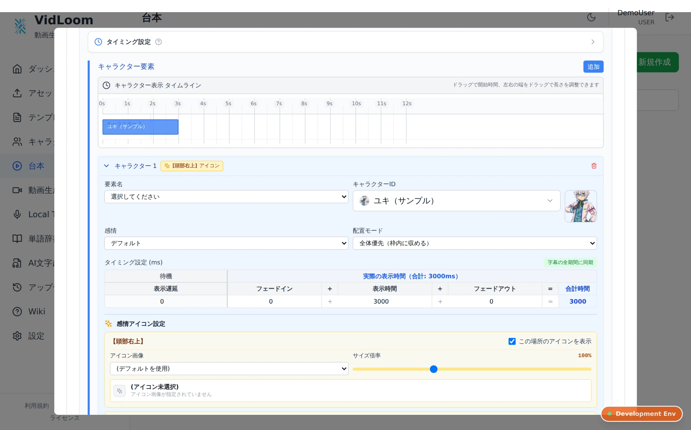

# 台本作成
動画の内容を構築する大事な機能についての解説  

## 使い方
- ページ右上の*新規作成*を押して編集画面にいく

- 台本の名前、使うテンプレートを設定する
  
- ノード/セルを展開する
イメージとしてノードは文章の段落やトピック単位、セルは、文章1文みたいなイメージ  

  
  
- テンプレートタイプの選択
セル内で使うテンプレートのタイプを選択します  
これをしないとこの後の作業ができません  

  
- 要素の設定
使いたい要素タイプを追加して、操作する要素を選んで詳細情報を入力します  

  

共通項目として、表示タイミングや時間、フェードイン/アウトの設定、特殊なアニメーションの追加ができます

  

  

なお、アニメーションの種類に関しては今後のアップデートで解説を追加予定です。  
  
- 効果音の設定
セル内の時間軸で、何ミリ秒後になんの音をどの音量で鳴らすかを設定できます  

- BGM設定  
ノード単位でBGMを設定できます  
鳴らすBGMの選択から、音量、ループ設定、終わり際の処理など設定できます  
また、次のノードも同じBGMを使っている場合は、続けて音を鳴らすこともできます  

## 小技集
- 各要素タイプの変更は同じ要素名で複数回することができるので、1文1セルに必ずしなくてもいい
    - そのタイプの編集をしやすくするために*タイミング設定*という場所で、新規に要素編集するときにタイミングを自動設定する機能がある

- 各要素に配置されているタイムラインは、直接操作ができる  
    - 正確な数値にしたい場合は別途タイミング設定で調整する必要あり

- Premiumプラン以上ではローカルTTSに喋らせる文章の読みを自動生成する機能がある  
    - 字幕テキストボックスの右上に"読み自動生成"というボタンがあり、押すと読みを自動で作成してくれます  
    - 間違った読みをしている単語はその場か"単語辞書"ページから読み方を登録することが可能です  
  

### 感情アイコンの制御（PRO / PREMIUMプラン）
セル内で「キャラクター要素」を追加し、感情アイコン設定がされたキャラクターを選択すると、そのセルの演出に合わせて感情アイコンを細かくコントロールできます。

- **自動連動**:
  - 感情を選択すると、キャラクター設定で紐付けられたデフォルトの感情アイコン（怒りマークや汗など）が自動で呼び出されます。
- **スロットごとの表示ON/OFF**:
  - 「この場所のアイコンを表示」チェックボックスで、そのセルでアイコンを表示するかどうかを場所ごとに切り替えられます。
- **アイコンの一時変更**:
  - キャラクター設定とは異なるアイコンをこのセルだけ表示したい場合、ドロップダウンから共通アイコンや固有アイコン、アセット画像を自由に選択して上書きできます。
- **サイズ倍率調整**:
  - スライダーでアイコンの大きさ（50%〜200%）を微調整でき、強調したいセリフのときにアイコンを大きく表示するなどの表現が可能です。
