# テンプレート作成
動画のレイアウトを司る重要機能  

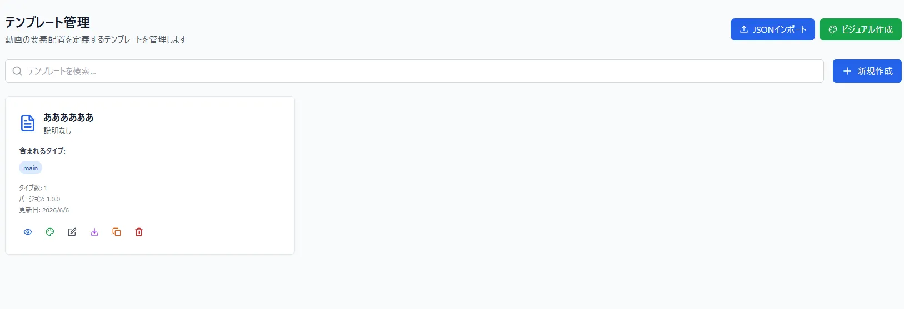  

## 作り方
- ページ右上の*ビジュアル作成*をクリックして編集画面に飛ぶ  

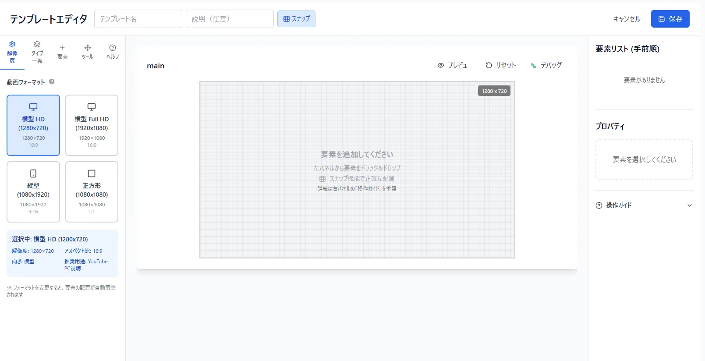
  
- 名前と説明(任意)を設定する

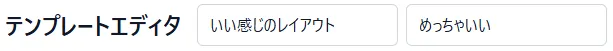

- フォーマット/解像度を指定  

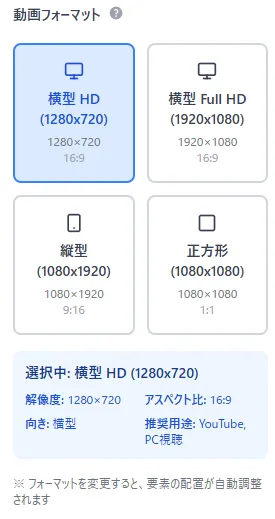

Youtubeの横動画、shorts,正方形などに対応しているので、好みのサイズを指定してください  
  
- タイプの追加、編集
タイプとは、1種類のレイアウトのことを言い、名前を変えたり、他のタイプを追加、編集するものの指定もできます  

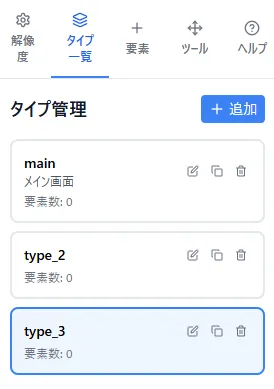  
  
- 要素  
動画のレイアウトに使うパーツです  
現状は、キャラクター、字幕、画像の3種類に対応してます  

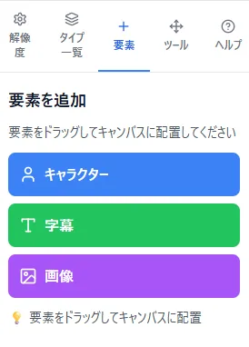
  
- レイアウト画面
画面中央にあるグリッドがレイアウト画面  
要素メニューで要素をクリックかドラッグすると配置することができ、マウスで要素を掴んで移動させたり、右下にあるハンドルを操作することでサイズを変更できます  

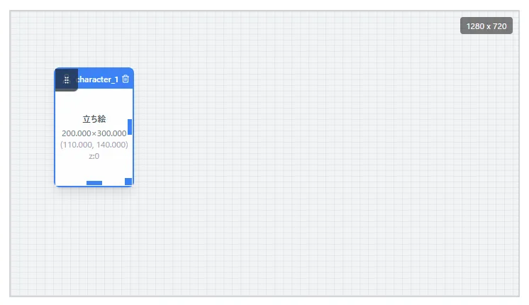  

また、レイアウト画面の右上にはプレビューがあり、自分がアップロードしているアセットを使って、簡易的にレイアウト確認ができます  

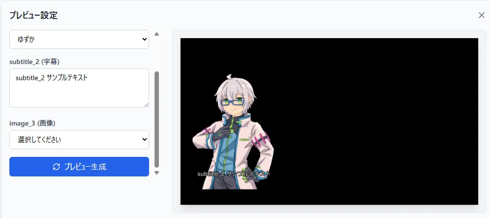  
  
- 要素リスト/プロパティ
レイアウト画面で配置した要素は、要素リストに表示されます  
要素リストはお絵かきリストのレイアウトのような性質を持っていて、上に配置された要素は前面に表示され、一番下に配置された要素は最背面に配置されます  

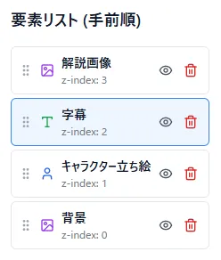  

また、レイアウト画面上、または要素リストで要素を選択するとプロパティを見たり編集することができます  
要素の名前やサイズを編集することができ、要素固有の設定項目も存在します  

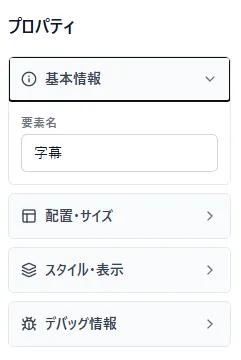  
  
要素固有の設定は以下の通り
  - キャラクター
    - 重なり順(要素リストでも編集可能)  
  
  - 画像
    - 重なり順(要素リストでも編集可能)
  
  - 字幕
    - 重なり順(要素リストでも編集可能)
    - 字幕の配置方式(垂直、水平)
    - フォントサイズ
    - 最大行数
        - フォントサイズと最大行数を設定すると、表示可能な文字数等の目安も確認できる
## 小技集
- 普段は要素の移動はグリッドにスナップしているが、ctrlを押すか、スナップボタンを押すと自由に配置できる  
- レイアウト画面上で要素のサイズを変更するときにshiftキーを押した状態で操作すると、左右上下対象でサイズ変更できる
- 要素の配置を真ん中とかキレイにしたい場合は、ツールと言うメニューから一発で実行できる

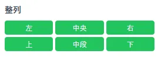

- 同じ要領で左右対称とかで要素を配置したい場合も軸を指定して配置することができる
  - 中心点を任意で設定することも可能

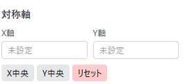
