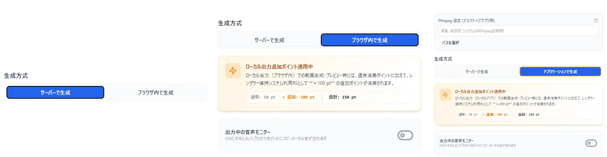
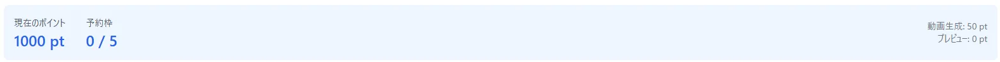
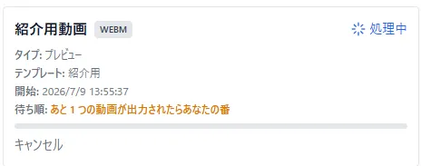
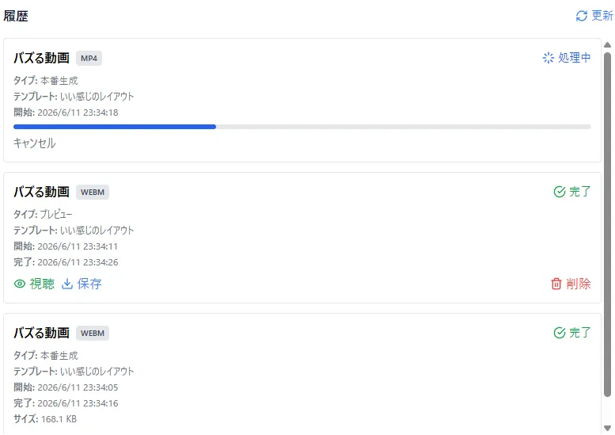

# 動画生成
作った台本は出力しなきゃ意味がない!  
出力方法の紹介です

## 2種類のレンダリング方法  
VidLoomでは全プランで使えるサーバーレンダリングと上位プラン(Premium / Proプラン)で使えるローカルレンダリングの2種類が存在します  
ローカルレンダリングは、Premiumプランで使えるWebブラウザを使ったレンダリングとProプランで使えるアプリを使ったレンダリングがあります  
どちらも順番待ちをせずに動画生成できますが、追加のポイント消費が発生します  

## 2パターンの出力  
動画生成には、**本番生成**と**プレビュー生成**の2種類があります
- 本番生成
台本に使用しているテンプレートで指定した解像度で出力されます  
後述するファイル形式によってはとても長い時間がかかります  
使用ポイントは指定した解像度によって変動(詳しくは右上らへんの表示を確認してください)

  
- プレビュー生成
台本の挙動を確認するための出力  
動画投稿には適さない形式  
台本に使用しているテンプレートで指定した解像度より小さいサイズで出力されます  
また、あくまで確認用なので、透かしが入ります  
プレビュー生成を動画投稿サイトにアップロードするのは禁止です  
使用ポイントは0pts

## ファイル形式
出力できるファイル形式には大きく**標準形式**と**透過対応形式**の2つがあります  

- 標準形式
  - MP4
  - WebM
  - AVI
    - 生成速度がとてつもなく遅く、ファイルサイズも大きくなりやすいので注意  
- 透過対応形式
素材が配置していない場所はすべて透過する動画形式、対応しているソフトが限りあるので注意  
  - WebM
  - HEVC(MP4)
  - MOV
    - 生成速度がとてつもなく遅く、ファイルサイズも大きくなりやすいので注意
  
## 予約枠
予約枠とは、ユーザーが仕込める動画生成キューの数です
枠は入っているプランによって変わって、以下の通りになります
|プラン|枠数|  
|:---|:---|  
|Starter|1枠|  
|Plus|2枠|  
|Premium|5枠|  
|Pro|5枠|  
  
予約枠は本番生成、プレビュー生成どちらも共通です  
また、あとどれぐらいで自分の順番になるかは履歴から確認できます  
  
  
## 履歴  
動画の生成をすると、履歴に進捗や結果がリストとして表示されます  

生成が成功した動画はここから確認やダウンロードが可能です(サーバーレンダリングのみ)  
なお、履歴を溜め込みすぎるとペナルティが発生して、使えるポイントの上限が減るため、適宜履歴をキレイにしましょう  
(サーバーのストレージ確保のため、ご協力お願いします)  
なお、履歴の蓄積件数に応じて、上限ポイントが徐々に減少していきます。  